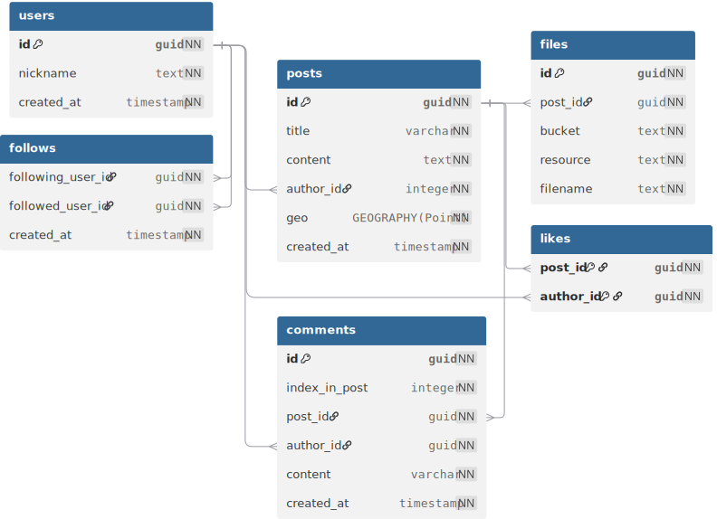
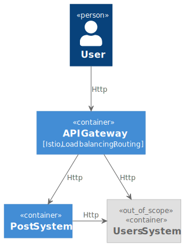
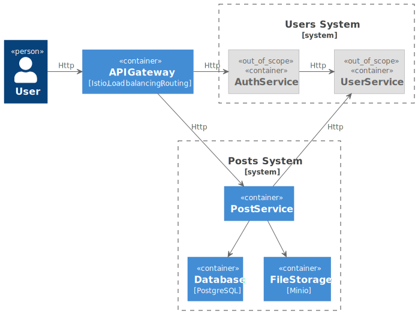

# Социальная сеть для путешественников
System Design социальной сети для курса по System Design

## Функциональные требования
- Публикация постов из путешествий с фотографиями, небольшим описанием и привязкой к конкретному месту путешествия
- Оценка и комментарии постов других путешественников
- Подписка на других путешественников, чтобы следить за их активностью
- Поиск популярных мест для путешествий и просмотр постов с этих мест
- Просмотр ленты других путешественников и ленты пользователя, основанной на подписках в обратном хронологическом порядке
- Доступность как через веб интерфейс, так и в мобильном приложении IOS, Android
## Нефункциональные требования

### Аудитория
- Количество пользователей: 10млн DAU, линейный рост
- Поведение пользователей:
  - 3 поста в месяц
  - 10 минут в день просмотр ленты
  - 10 прочитанных постов в день
  - 1 открытая в полном размере картинка на 10 постов
  - 2 комментария в день
  - 2 лайка в день
  - 1 подписка/отписка за 10 дней
- Регионы использования: Только СНГ
- Сезонность: X2.0 на создание постов, X1.2 на просмотр

### Особенности
- Условия хранения данных: Данные храним всегда
- Лимиты и ограничения:
  - 1 пост в день (возможно расширение в премиум доступе)
  - Количество подписок: до 10 запросов на подписку в день
  - Появление поста у подписчиков: как можно быстрее после публикации
  - 100 комментариев к посту
  - 1000 подписок
  - 10Кб на пост
  - 500Кб на картинку к посту (FullHD)
  - 256 символов на комментарий, 100 комментариев на пост
- Уровень доступности: 99,9%
- Латентность:
  - p95 <= 5s   (создание поста)
  - p95 <= 5s    (список постов)
  - p95 <= 2s    (чтение)
  - p95 <= 300ms (запись)

### Отказоустойчивость
- Бэкапы: минимум 3шт, дневной, недельный, месячный
- Репликация: master + sync + async (N шт)
- Хранение данных: пользовательские данные хранятся всегда
- Кластеризация: минимум 2
 
## Оценка нагрузки
- Посты
  - Создание 10 млн постов в день _(10 000 000 / 86400 = 120 RPS, 120 х 80kbps = 9.6kbps = 10Mbps)_
  - Добавление 3 фотографий на пост _(360 RPS for S3, 360 х 3 х 500 000 х 8bps = 4.32Gbps)_
  - Просмотр 100 млн постов в день _(1200 RPS, 100Mbps)_
  - Просмотр 300 млн фотографий в день _(3600 RPS for S3, 5.76Gbps)_
- Комментарии
  - 20 млн новых комментариев в день _(240 RPS, 2Mbps)_
  - Просмотр 20 млн списков комментариев в день _(240 RPS, 2Gbps)_
- Лайки
  - Просмотр общего количества лайков под постом 100 млн _(1200 RPS, 40Kbps)_
  - Лайк под постом 20 млн _(240 RPS)_
- Подписки
  - 100 млн подписок в день _(1200 RPS)_

### Сводная таблица по нагрузкам и лимитам
| **Компонент**     | **Операций/день** | **RPS** | **Метаданные** | **bps** | **p95** | **Медиа** | **Медиа bps** |
|-------------------|-------------------|---------|----------------|-------------------|-----------|---------------|
| Posts (POST)      |        10 000 000 |     120 |          10 KB |     10M |  5000ms |    1.5 MB |         4.32G |
| Posts (GET)       |       100 000 000 |    1200 |          10 KB |    100M |  5000ms |    1.5 MB |         43.2G |
| Comments (POST)   |        20 000 000 |     240 |           1 KB |      2M |   300ms |    -      |       -       |
| Comments (GET)    |        20 000 000 |     240 |          25 KB |    500M |  2000ms |    -      |       -       |
| Likes (POST)      |        20 000 000 |     240 |           1 KB |      2M |   300ms |    -      |       -       |
| Likes (GET)       |       100 000 000 |    1200 |           1 KB |    1.2M |   300ms |    -      |       -       |
| Subscribes (POST) |         1 000 000 |      12 |           1 KB |     12K |   300ms |    -      |       -       |
| Subscribes (GET)  |         1 000 000 |      12 |          10 KB |    120K |  2000ms |    -      |       -       |

### Сводная таблица по количеству дисков для хранения данных за 1 год
- Реплики: 1 sync + 1 async
- Бэкапы:  3шт, вчера, неделя, месяц
- Медиа:   1 копия

| **Компонент** | **Данные** | **HDD (32TB)** | **SSD (8TB)** | **Replicas** | **HDD Backups** | 
| Посты         |    12.2 TB |                |               |              |                 |
| Комментарии   |     5.1 TB |                |               |              |                 |
| Файлы (мета)  |     880 GB |                |               |              |                 |
| Лайки         |     233 GB |                |               |              |                 |
| Подписчики    |    14.5 GB |                |               |              |                 |
| Пользователи  |     5.3 GB |                |               |              |                 |
------------------------------------------------------------------------------------------------
| Мета данные   |      20 TB |              - |             3 |            6 |               3 |
| Медиа данные  |   5 475 TB |            171 |             - |            - |             171 |

Расчёт постов: 10 000 000 * 365 * 10 KB = 365 * 100 GB = 36 500 GB + Postgre zstd (1/3) = 12.2 TB
Расчёт комментариев: 20 000 000 * 365 * (2048 + 16 + 8 + 16 + 8 + 8)B = 15,3 TB + Postgre zstd (1/3) = 5,1 TB
Расчёт файлов: 10 000 000 * 3 * 365 * (16 + 16 + 16 + 16 + 16) = 876 GB
Расчёт лайков: 10 000 000 * 2 * 365 * (16 + 16)В = 640MB * 365 = 233 GB
Расчёт подписок: 1 000 000 * 365 * (16 + 16 + 8)B = 365 * 40 MB = 14.5 GB
Расчёт пользователей: 10 000 000 * (16 + 64*8 + 8)В = 5.3 GB 

## Схема базы данных

## Дизайн системы
### С1: System Context

### С2: System Container (Posts System)
